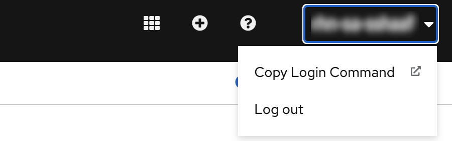

# devsandbox-example project

This project uses Quarkus, the Supersonic Subatomic Java Framework. 

You just started working with Quarkus and you want to try out how to deploy your application on Openshift. This project uses the Github actions and deploys this barebones app onto the [Red Hat Developer Sandbox for Openshift](https://developers.rehdat.com/developer-sandbox)

To deploy this project on the Sandbox, make sure you setup 3 secrets in your github repo. 
- OPENSHIFT_SERVER_URL
- OPENSHIFT_NAMESPACE
- OPENSHIFT_TOKEN

Where to find the above. If you havent signed up to the [Red Hat Developer Sandbox for Openshift](https://developers.rehdat.com/developer-sandbox) , you should do it now. Once logged into your new Openshift Sandbox environment click on the right hand corner where it states your login name, and then "Copy login command"



You will find the token and the server url at that link. 
e.g. 

```
oc login --token=XXXX --server=https://api.XXX.openshiftapps.com:6443
```
Dont forget to add the namespace you want to deploy to. in my case I use the `-dev` namespace.


To check if the deployment was successful you can also check the Github action in your repo.
 


If you want to learn more about Quarkus, please visit its website: https://quarkus.io/ .

## Running the application in dev mode

You can run your application in dev mode that enables live coding using:
```shell script
./mvnw compile quarkus:dev
```

## Packaging and running the application

The application can be packaged using:
```shell script
./mvnw package
```
It produces the `devsandbox-example-1.0.0-SNAPSHOT-runner.jar` file in the `/target` directory.
Be aware that it’s not an _über-jar_ as the dependencies are copied into the `target/lib` directory.

If you want to build an _über-jar_, execute the following command:
```shell script
./mvnw package -Dquarkus.package.type=uber-jar
```

The application is now runnable using `java -jar target/devsandbox-example-1.0.0-SNAPSHOT-runner.jar`.

## Creating a native executable

You can create a native executable using: 
```shell script
./mvnw package -Pnative
```

Or, if you don't have GraalVM installed, you can run the native executable build in a container using: 
```shell script
./mvnw package -Pnative -Dquarkus.native.container-build=true
```

You can then execute your native executable with: `./target/devsandbox-example-1.0.0-SNAPSHOT-runner`

If you want to learn more about building native executables, please consult https://quarkus.io/guides/maven-tooling.html.

# RESTEasy JAX-RS

<p>A Hello World RESTEasy resource</p>

Guide: https://quarkus.io/guides/rest-json
